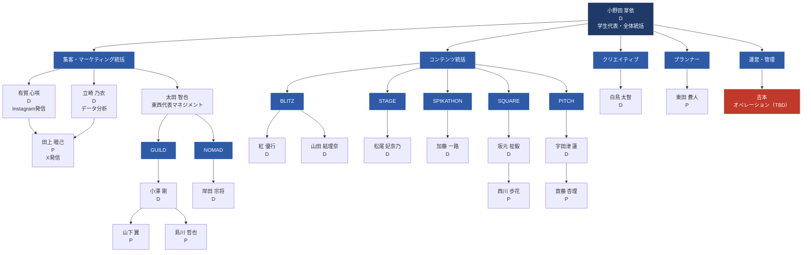
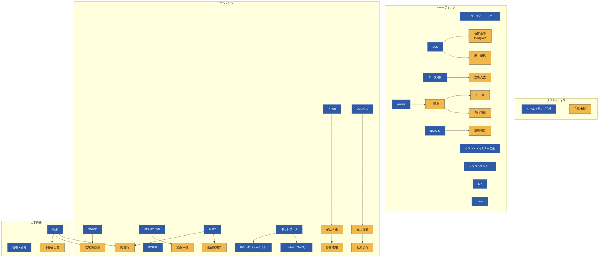

# SPIKES (in IVS) 2026 組織図

Notion「メンバー」ページとGoogle Sheets「組織」タブを統合。

> **凡例**: `D` = ディレクター / `P` = プランナー

## 企画コンテンツ × 担当者マップ

各コンテンツ（上段）と担当リード（下段）の対応。

## 元データ
- Notion: https://www.notion.so/techweek/34257f3cbb7880e5a7c9fdb76ac4ffc4
- Google Sheets: https://docs.google.com/spreadsheets/d/1K-MvzzDbFs6m05ytU3WtkOfGm3vV99TrSTWF5ajYbSU
